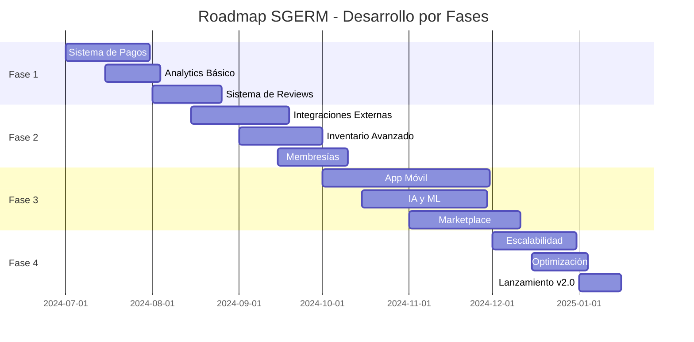

# 🗺️ Roadmap de Desarrollo - SGERM 2024-2025

## 📅 **Cronograma General**



---

## 🎯 **FASE 1: Funcionalidades Core (Julio - Agosto 2024)**

### **Prioridad ALTA** 🔴

#### **1.1 Sistema de Pagos Integrado**
**Duración**: 4 semanas | **Esfuerzo**: 120 horas

**Objetivos:**
- Integración completa con Stripe
- Soporte para múltiples métodos de pago
- Sistema de reembolsos automático
- Facturación electrónica

**Entregables:**
- [ ] PaymentService con Stripe SDK
- [ ] PaymentController con endpoints REST
- [ ] Webhook handler para eventos de Stripe
- [ ] Modelos: Payment, Invoice, Refund
- [ ] Tests unitarios e integración
- [ ] Documentación API

**Criterios de Aceptación:**
- ✅ Procesar pagos con tarjeta de crédito/débito
- ✅ Generar facturas automáticamente
- ✅ Manejar reembolsos parciales y totales
- ✅ Webhook security validation
- ✅ Manejo de errores y reintentos

---

#### **1.2 Dashboard de Analytics**
**Duración**: 3 semanas | **Esfuerzo**: 90 horas

**Objetivos:**
- Métricas en tiempo real
- Reportes de ingresos
- Análisis de eventos populares
- KPIs de conversión

**Entregables:**
- [ ] AnalyticsService con cálculos de métricas
- [ ] AnalyticsController con endpoints
- [ ] Modelos: DashboardMetrics, RevenueReport
- [ ] Cache con Redis para optimización
- [ ] Scheduled tasks para reportes

**Criterios de Aceptación:**
- ✅ Dashboard con métricas clave
- ✅ Filtros por fecha y categoría
- ✅ Exportación de reportes (PDF/Excel)
- ✅ Actualización en tiempo real
- ✅ Performance < 2 segundos

---

#### **1.3 Sistema de Reviews y Ratings**
**Duración**: 3.5 semanas | **Esfuerzo**: 100 horas

**Objetivos:**
- Reviews verificadas por asistencia
- Sistema de moderación
- Ratings por aspectos
- Reputación de organizadores

**Entregables:**
- [ ] ReviewService con validaciones
- [ ] ReviewController con CRUD
- [ ] Modelos: Review, Rating, ReviewStatistics
- [ ] Sistema de moderación automática
- [ ] Algoritmo de reputación

**Criterios de Aceptación:**
- ✅ Solo usuarios que asistieron pueden reseñar
- ✅ Moderación automática de contenido
- ✅ Cálculo de rating promedio
- ✅ Estadísticas detalladas por evento
- ✅ API para obtener reviews paginadas

---

### **Prioridad MEDIA** 🟡

#### **1.4 Notificaciones Mejoradas**
**Duración**: 2 semanas | **Esfuerzo**: 60 horas

- Templates personalizables
- Múltiples canales (Email, SMS, Push)
- Programación de envíos
- Tracking de apertura

#### **1.5 API Documentation**
**Duración**: 1 semana | **Esfuerzo**: 30 horas

- Swagger/OpenAPI 3.0
- Ejemplos interactivos
- Guías de integración
- Postman collections

---

## 🚀 **FASE 2: Integraciones y Expansión (Agosto - Octubre 2024)**

### **Prioridad ALTA** 🔴

#### **2.1 Integraciones con APIs Externas**
**Duración**: 5 semanas | **Esfuerzo**: 150 horas

**Servicios a Integrar:**

**Google Maps API:**
```java
@Service
public class LocationService {
    public LocationDetails getLocationDetails(String address) {
        // Geocoding, validación de direcciones
        // Cálculo de distancias
        // Sugerencias de ubicaciones
    }
    
    public List<NearbyPlace> findNearbyPlaces(double lat, double lng, String type) {
        // Hoteles, restaurantes, transporte
    }
}
```

**Twilio SMS/WhatsApp:**
```java
@Service
public class SmsService {
    public void sendBookingConfirmation(String phone, BookingDetails booking) {
        // SMS de confirmación
        // Recordatorios automáticos
        // Códigos QR por WhatsApp
    }
}
```

**Weather API:**
```java
@Service
public class WeatherService {
    public WeatherForecast getEventWeather(Event event) {
        // Pronóstico para eventos al aire libre
        // Alertas meteorológicas
        // Recomendaciones automáticas
    }
}
```

---

#### **2.2 Gestión Avanzada de Inventario**
**Duración**: 4 semanas | **Esfuerzo**: 120 horas

**Funcionalidades:**
- Tracking en tiempo real
- Predicción de demanda con ML
- Alertas de stock bajo
- Gestión de proveedores
- Códigos QR/Barcode

**Modelos Nuevos:**
```java
@Entity
public class InventoryItem {
    private Long id;
    private Resource resource;
    private Integer currentStock;
    private Integer minimumStock;
    private Integer reservedStock;
    private BigDecimal unitCost;
    private Supplier supplier;
    private String barcode;
    private LocalDateTime lastRestocked;
    // ...
}

@Entity
public class StockMovement {
    private Long id;
    private InventoryItem item;
    private MovementType type; // IN, OUT, RESERVED, RELEASED
    private Integer quantity;
    private String reason;
    private User performedBy;
    private LocalDateTime timestamp;
    // ...
}
```

---

#### **2.3 Sistema de Membresías**
**Duración**: 3.5 semanas | **Esfuerzo**: 100 horas

**Tipos de Membresía:**
- Mensual/Anual
- Por categoría de eventos
- Corporativa
- VIP con beneficios especiales

**Beneficios:**
- Descuentos automáticos
- Acceso prioritario
- Eventos exclusivos
- Cancelación flexible

---

### **Prioridad MEDIA** 🟡

#### **2.4 CRM Básico**
**Duración**: 3 semanas | **Esfuerzo**: 90 horas

- Segmentación de usuarios
- Historial de interacciones
- Campañas de email marketing
- Lead scoring

#### **2.5 Reportes Avanzados**
**Duración**: 2 semanas | **Esfuerzo**: 60 horas

- Reportes personalizables
- Exportación automática
- Dashboards por rol
- Alertas inteligentes

---

## 📱 **FASE 3: Experiencia Mobile y AI (Octubre - Diciembre 2024)**

### **Prioridad ALTA** 🔴

#### **3.1 Aplicación Móvil Nativa**
**Duración**: 8 semanas | **Esfuerzo**: 240 horas

**Tecnologías:**
- React Native / Flutter
- Push notifications
- Offline capabilities
- Biometric authentication

**Funcionalidades Clave:**
- Búsqueda y reserva de eventos
- Check-in con QR
- Wallet digital
- Chat en tiempo real
- Mapa interactivo

**Arquitectura:**
```
┌─────────────────┐    ┌─────────────────┐
│   Mobile App    │    │   Web App       │
│  (React Native) │    │   (React/Vue)   │
└─────────────────┘    └─────────────────┘
         │                       │
         └───────────┬───────────┘
                     │
         ┌─────────────────┐
         │   API Gateway   │
         │   (Spring Boot) │
         └─────────────────┘
                     │
    ┌────────────────┼────────────────┐
    │                │                │
┌───▼───┐    ┌──────▼──────┐    ┌────▼────┐
│ Auth  │    │  Business   │    │  Data   │
│Service│    │   Logic     │    │ Layer   │
└───────┘    └─────────────┘    └─────────┘
```

---

#### **3.2 Inteligencia Artificial y ML**
**Duración**: 6 semanas | **Esfuerzo**: 180 horas

**Funcionalidades IA:**

**Recomendaciones Personalizadas:**
```python
# Modelo de recomendación (Python/TensorFlow)
class EventRecommendationModel:
    def __init__(self):
        self.model = self.build_collaborative_filtering_model()
    
    def recommend_events(self, user_id, num_recommendations=5):
        user_preferences = self.get_user_preferences(user_id)
        similar_users = self.find_similar_users(user_id)
        recommended_events = self.generate_recommendations(
            user_preferences, similar_users, num_recommendations
        )
        return recommended_events
```

**Predicción de Demanda:**
```java
@Service
public class DemandPredictionService {
    
    @Autowired
    private MLModelClient mlModelClient;
    
    public DemandForecast predictEventDemand(Event event) {
        EventFeatures features = extractFeatures(event);
        PredictionRequest request = new PredictionRequest(features);
        
        DemandPrediction prediction = mlModelClient.predict(request);
        
        return DemandForecast.builder()
            .eventId(event.getId())
            .predictedAttendance(prediction.getAttendance())
            .confidenceScore(prediction.getConfidence())
            .recommendedPricing(prediction.getOptimalPrice())
            .build();
    }
}
```

**Chatbot Inteligente:**
```java
@RestController
@RequestMapping("/api/chatbot")
public class ChatbotController {
    
    @PostMapping("/message")
    public ResponseEntity<ChatResponse> processMessage(
            @RequestBody ChatMessage message) {
        
        // NLP processing
        Intent intent = nlpService.detectIntent(message.getText());
        
        // Generate response
        ChatResponse response = switch (intent.getType()) {
            case EVENT_SEARCH -> handleEventSearch(intent);
            case BOOKING_INQUIRY -> handleBookingInquiry(intent);
            case SUPPORT_REQUEST -> handleSupportRequest(intent);
            default -> generateGenericResponse(intent);
        };
        
        return ResponseEntity.ok(response);
    }
}
```

---

#### **3.3 Marketplace de Servicios**
**Duración**: 5 semanas | **Esfuerzo**: 150 horas

**Servicios del Marketplace:**
- Catering
- Fotografía/Video
- Decoración
- Seguridad
- Transporte
- Entertainment

**Modelo de Negocio:**
- Comisión por transacción (5-10%)
- Suscripción premium para proveedores
- Publicidad destacada
- Servicios de verificación

---

### **Prioridad MEDIA** 🟡

#### **3.4 Sistema de Streaming**
**Duración**: 4 semanas | **Esfuerzo**: 120 horas

- Eventos virtuales/híbridos
- Integración con Zoom/Teams
- Grabación automática
- Chat en vivo

#### **3.5 Gamificación**
**Duración**: 3 semanas | **Esfuerzo**: 90 horas

- Sistema de puntos
- Badges y logros
- Leaderboards
- Recompensas por fidelidad

---

## ⚡ **FASE 4: Optimización y Escalabilidad (Diciembre 2024 - Enero 2025)**

### **4.1 Arquitectura de Microservicios**
**Duración**: 4 semanas | **Esfuerzo**: 120 horas

**Separación de Servicios:**
```
┌─────────────┐  ┌─────────────┐  ┌─────────────┐
│   User      │  │   Event     │  │  Booking    │
│  Service    │  │  Service    │  │  Service    │
└─────────────┘  └─────────────┘  └─────────────┘
       │                │                │
       └────────────────┼────────────────┘
                        │
┌─────────────┐  ┌─────────────┐  ┌─────────────┐
│  Payment    │  │ Notification│  │ Analytics   │
│  Service    │  │  Service    │  │  Service    │
└─────────────┘  └─────────────┘  └─────────────┘
```

**Tecnologías:**
- Spring Cloud Gateway
- Service Discovery (Eureka)
- Circuit Breaker (Hystrix)
- Distributed Tracing (Zipkin)
- Message Queue (RabbitMQ/Kafka)

---

### **4.2 Performance y Monitoring**
**Duración**: 3 semanas | **Esfuerzo**: 90 horas

**Optimizaciones:**
- Database indexing
- Query optimization
- Caching strategies
- CDN implementation
- Load balancing

**Monitoring Stack:**
- Prometheus + Grafana
- ELK Stack (Elasticsearch, Logstash, Kibana)
- APM (Application Performance Monitoring)
- Health checks
- Alerting system

---

### **4.3 Security Hardening**
**Duración**: 2 semanas | **Esfuerzo**: 60 horas

**Medidas de Seguridad:**
- OAuth 2.0 / OpenID Connect
- Rate limiting
- Input validation
- SQL injection prevention
- XSS protection
- CSRF tokens
- Audit logging

---

## 📊 **Métricas de Éxito por Fase**

### **Fase 1 - KPIs:**
- ✅ 95% de pagos procesados exitosamente
- ✅ Dashboard carga en < 3 segundos
- ✅ 80% de eventos con reviews
- ✅ 0 vulnerabilidades críticas

### **Fase 2 - KPIs:**
- ✅ 99.9% uptime de integraciones
- ✅ Predicción de inventario 85% precisa
- ✅ 30% de usuarios con membresía
- ✅ 50% reducción en stock-outs

### **Fase 3 - KPIs:**
- ✅ 10,000+ descargas de app móvil
- ✅ 70% precisión en recomendaciones
- ✅ $100K+ GMV en marketplace
- ✅ 4.5+ rating en app stores

### **Fase 4 - KPIs:**
- ✅ 99.99% disponibilidad del sistema
- ✅ < 100ms latencia promedio API
- ✅ Soporte para 100K+ usuarios concurrentes
- ✅ Certificación SOC 2 Type II

---

## 💰 **Estimación de Recursos**

### **Equipo Requerido:**
- **Backend Developers**: 2-3 personas
- **Frontend Developers**: 2 personas
- **Mobile Developers**: 1-2 personas
- **DevOps Engineer**: 1 persona
- **QA Engineer**: 1 persona
- **Product Manager**: 1 persona
- **UI/UX Designer**: 1 persona

### **Presupuesto Estimado:**
- **Desarrollo**: $150,000 - $200,000
- **Infraestructura**: $2,000 - $5,000/mes
- **Servicios externos**: $1,000 - $3,000/mes
- **Marketing**: $10,000 - $20,000

### **ROI Proyectado:**
- **Año 1**: Break-even
- **Año 2**: 150% ROI
- **Año 3**: 300% ROI

---

## 🎯 **Próximos Pasos Inmediatos**

1. **Semana 1-2**: Setup del entorno de desarrollo
2. **Semana 3-4**: Implementación del sistema de pagos
3. **Semana 5-6**: Dashboard de analytics básico
4. **Semana 7-8**: Sistema de reviews
5. **Semana 9-10**: Testing e integración

¡El futuro de SGERM está claramente definido! 🚀✨